# 💬😄😢😲💬 Local AI Chat Emotionizer_V2 💬😳😡🤢💬

[](https://www.python.org/downloads/)
[](https://opencv.org/)
[](https://fastapi.tiangolo.com/)
[](LICENSE)

**The world's first real-time chatbot framework with emotional context awareness and improve your text messages accordingly**  
Powered by **OpenCV**, **FER + MTCNN**, and **Ollama** for emotionally intelligent conversations.


## ✨ Why Emotionizer V2?

- **Real-time emotion integration**: Chatbot adapts to your facial expressions
- **Multi-modal experience**: Video + Text + Emotion visualization
- **Privacy-first**: No cloud processing - all computations happen locally
- **Cutting-edge stack**: Combines computer vision with large language models with emotion context

```mermaid
flowchart LR
  A("🖼️ OpenCV"):::opencv --> B("🔍 MTCNN Face Detection"):::detector
  B --> C("😊 FER Emotion Recognition"):::fer
  C --> D("💡 Emotion Context Engine"):::context
  D --> E("🤖 Ollama AI Model"):::ai
  E --> F("❤️ Emotion-Aware Responses"):::output

  classDef opencv   fill:#6366F1,stroke:#4F46E5,stroke-width:2px,color:#fff;
  classDef detector fill:#2563EB,stroke:#1E40AF,stroke-width:2px,color:#fff;
  classDef fer      fill:#10B981,stroke:#047857,stroke-width:2px,color:#fff;
  classDef context  fill:#F59E0B,stroke:#B45309,stroke-width:2px,color:#fff;
  classDef ai       fill:#EF4444,stroke:#9B1C1C,stroke-width:2px,color:#fff;
  classDef output   fill:#8B5CF6,stroke:#6B21A8,stroke-width:2px,color:#fff;
```



## 📦 Prerequisites

- Python 3.8+
- Webcam connected
- ollama CLI / SDK configured with your AI model

Make sure you downloaded an model using ollama

If you didn't, a model can be downloaded this way(default : **llama2**):

```bash
ollama pull llama2
```

---

## 🔧 Installation

**Clone the repo:**

```bash
git clone https://https://github.com/UserEdmund/LiveChatEmotionizer_v2.git
cd LiveChatEmotionizer_v2
```
**Install dependencies:**
```bash
pip install -r requirements.txt
```

## 🚀 Running the Application

**Run Ollama server**

```bash
ollama serve
```

**Start the FastAPI server:**
```bash
uvicorn backend.main:app --reload
```

**Open your browser and go to:**
```markdown
http://localhost:8000
```


**📸 Allow webcam access if prompted 📊 See live video, emotion chart, and start chatting!**

# Acknowledgments

### Special thanks to:

- FER for facial emotion recognition

- Ollama for open-source AI framework

- FastAPI for efficient web framework

- OpenCV for computer vision capabilities

This project combines cutting-edge AI technologies to create an emotionally intelligent chat experience.
